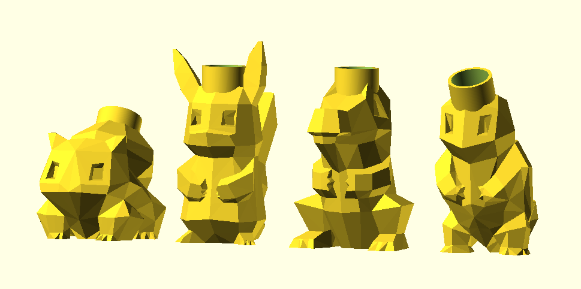

# Pokemon Christmas Lights

> In december 2017 I joined in a [Secret Santa event](https://www.facebook.com/events/189537648284407/) organised by [Henk Reickaert](http://www.henkrijckaert.be), amongst others known for his fun making endavours in the [Koterij](http://www.koterij.be).

> [!IMPORTANT]  
> This repo has been [archived](https://docs.github.com/en/repositories/archiving-a-github-repository/archiving-repositories#)

Read the full story of these [Pokemon Christmas Lights](https://christophe.vg/technology/Pokemon-Christmas-Lights) with more pictures on my website.

From left to right, linked to their Thingiverse page:

* [Bulbasaur](https://www.thingiverse.com/thing:2692444)
* [Pikachu](https://www.thingiverse.com/thing:2692445)
* [Totodile](https://www.thingiverse.com/thing:2692446)
* [Squirtle](https://www.thingiverse.com/thing:2692449)
* [Charmander](https://www.thingiverse.com/thing:2697678)

This repository contains the [OpenSCAD model](src/pokemon.scad) with all four Pokemons, as well as the resulting [individual STL files](src/), and a copy of the [original STL files](lib/) I found on [Thingiverse](https://www.thingiverse.com) by [Flowalistik](https://www.thingiverse.com/FLOWALISTIK/about).
